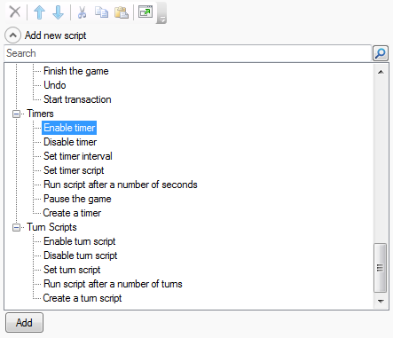

Much of the Editor user interface is defined by the core library itself, and the sub-libraries linked via CoreEditor.aslx. Look at the CoreEditor\*.aslx files for examples on creating a user interface for a library.

To add an Editor User Interface for a function defined in your library, add a section to your library like this:

     <editor>
        <appliesto>(function)EnableTimer</appliesto>
        <display>Enable timer #0</display>
        <category>Timers</category>
        <create>EnableTimer ()</create>
        <add>Enable timer</add>
     
        <control>
          <controltype>label</controltype>
          <caption>Enable timer</caption>
        </control>
     
        <control>
          <controltype>expression</controltype>
          <attribute>0</attribute>
          <simple>name</simple>
          <simpleeditor>objects</simpleeditor>
          <source>timer</source>
        </control>
     </editor>

The example above adds the "Enable timer" command to the "Timers" category:

When selected, the editor looks like this - the example above defines two controls, a label reading "Enable timer" and an expression control, which shows the "timer" dropdown:

appliesto  
Should be of the format "(function)YourFunctionName"

display  
Text description of the command. "\#x" represents the value of parameter x.

category  
The category to use in the script adder

create  
Blank version of the command created when the user selects this command in the adder

add  
Description of the command to display in the script adder

control  
Multiple <control> elements specify labels and input parameters.

Within a <control> XML tag, you must specify a controltype from the list below. If the control corresponds to a parameter (and it usually will, except for a label), you must also use an <attribute> tag to specify which parameter.

The following controltypes can be used:

-   checkbox
-   dropdown
-   dropdowntypes
-   elementslist
-   expression
-   file
-   filter
-   label
-   list
-   multi
-   number
-   objects
-   script
-   scriptdictionary
-   scriptexpander
-   stringdictionary
-   textbox

The following additional controltypes are also available, but are probably not much use in extension libraries:

-   attributes
-   exits
-   richtext
-   pattern
-   texteditor
-   title
-   verbs

