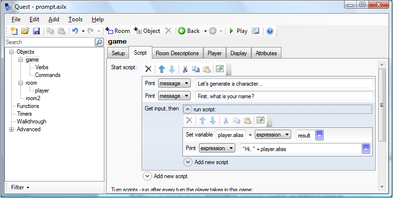

Some text adventures leave the protagonist an empty slate, with no background or even a specific gender. In others, the protagonist is a certain person, and for the course of the game the player assumes the role of someone devised by the author. The third option is to let the player choose - afterall, that is the nature of the genre.

To do that in Quest involves setting up a start script on the game object and asking the player a series of questions.

Go to the "Script" tab of the "game" object. The start script is at the top. Set the script to print a message prompting the player, then select "Get input" from the "Output" options. Set it up like this:

In code view it will look like this:

        <start type="script">
          msg ("Let's generate a character...")
          msg ("First, what is your name?")
          get input {
            player.alias = result
            msg ("Hi, " + player.alias)
          }
        </start>

The important part is the "get input" command, which grabs the next thing the player types and puts it into the string variable "result". This is then used to set the player alias.

The game has to wait for the player to do something, and to ensure it does all subsequent code goes into its own block (that is, the indented part between the curly braces).

If you want to ask several questions, you need blocks with blocks within blocks. This is perfectly possible in the GUI view, but starts to get a bit messy, so seriously consider doing this in code view.

In code view it will look like this:

        <start type="script">
          msg ("Let's generate a character...")
          msg ("First, what is your name?")
          get input  {
            player.alias = result
            msg ("Hi, " + player.alias)
            show menu ("Your gender?", Split ("Male;Female", ";"), false) {
              player.gender = result
              show menu ("Your character class?", Split ("Warrior;Wizard;Priest;Thief", ";"), false) {
                player.class = result
                msg (" ")
                msg (player.alias + " was a " + LCase (player.gender) + " " + LCase (player.class) + ".")
                msg (" ")
                msg ("Now press a key to begin...")
                wait {
                  ClearScreen
                }
              }
            }
          }
        </start>

I am using the "show menu" command this time, to limit the player's choices, in the first instance to either "Male" or "Female". A menu needs a string list containing the options, and Split gives a quick way to create one:

      Split ("Male;Female", ";")

The "set menu" function also taks a string, the propmt for the menu, and a Boolean signally if the player is allowed to click cancel (which we do not want in this case). As before, the result goes into a string variable called "result".

After also asking for the character class, the screen is cleared. The "wait" command waits until the player presses a key before running its block.
