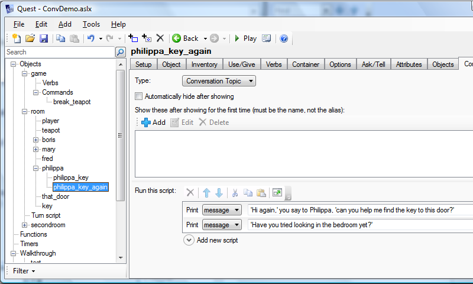
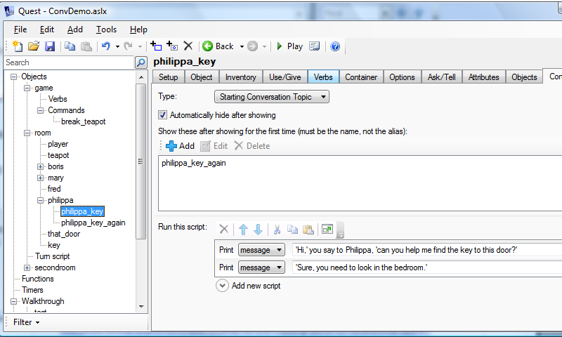
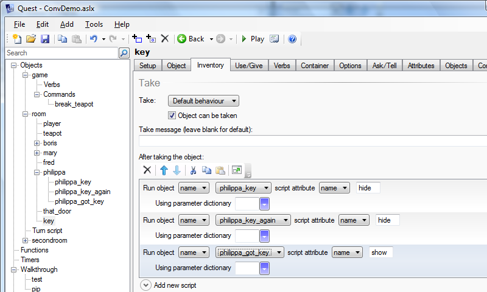

A convient way to create interactive conversations.

Contributed by: The Pixie

This is a way to set up conversations in a game. The player types "Talk To <character>" and is presented with a menu of available topics, but the topics change over the course of the game. For example, once the player has the key, the menu choice "Where is key" is no longer displayed.

This kind of follows on from the page on [Conversations](conversations.html), and uses the same example, so you might like to briefly look at that.

The system is set up using the ConvLib library (right click and save to your computer):

[ConvLib.aslx]({{site.baseurl}}/files/ConvLib.aslx)

### Setting Up

The first thing you need to do is to include the library in your game, so (once you have it downloaded) expand the "Advanced" object in the left pane, then click on "Included Libraries". In the right pane, click on "Add", and navigate to the downloaded file (Quest will copy the file to your game folder). Save and reload.

### Characters

If you select a character, you should see a new tab has appeared, "Conversation". Go to this tab, and set your character's type to "Character". You may like to put in a greeting. This can be some text or a script, or both as in the example below (the text will appear before the script runs). This will run the first time the player talks to this character, so could be introductions or just a greeting. You can leave it blank if you prefer.

### Topics

ConvLib treats each topic as an object in its own right. To give a character a topic, right click on the character, select "Add Object", and give it a name (I put the character's name at the start, so I know whose it is). Before clicking okay, select the character from the dropdown menu (if you forget to do this, drag the topic object into the character).

Give the topic an alias. This is the option that will be presented to the player in the menu. Every conversation topic *must* have an alias, and it cannot contain any apostrophes.

Now go to the "Conversation" tab again. The type must be set to "Starting Conversation Topic" or "Conversation Topic" (depending on whether this will be available from the start, of course).

You can have new topics appear in the menu after the player has seen this one. Add the name (not the alias) to the list. This can be a topic for another character, by the way.

Now we can add the conversation is the text.

This is set up to disappear aftert the player sees it, to be replaced by philippa\_key\_again.

You can also add a script to run as well; as with the greeting this will happen after the text is printed.

Conversation objects have scripts on them that will show them and hide them, so we can use that to change the topics when the key is taken. On the "Inventory" tab for the key:

Both key topics will be hidden, as we do not know which will be showing when the key is taken; a new topic will appear instead. Note that the "hide" script takes priority over "show". Once a topic has been hidden, it will not appear later even if you call show for it.

If you prefer code, it looks like this:

    do (philippa_key, "hide")
    do (philippa_key_again, "hide")
    do (philippa_got_key, "show")

    
### Active conversations    
    
Active conversations keep going, after one topic has been done, the player will be presented with a new list of topics, without having to type SPEAK TO... This will end if the character runs out of topics.

Ticking "Keep conversations active" for a character will make conversations with this character "active". If you also tick "Force player to converse", the player will *have* to select a conversation topic (by default when a list of topics is presented, the player can ignore them, and type in another command). Be careful, there is the potential to get the player stuck in a loop here.

You can create a "good-bye" topic by ticking "Terminates an active conversation" for the topic. The player can choose this to terminate an active conversation, as the name suggests.
    
    
### Other Options For Characters

If the character is an animal, you can tick the "Can only talk with this character if player.talktoanimals is true". The character will only converse if the Boolean attribute "talktoanimals" on the player is set to true.

### Other Options For Topics

"Automatically hide after showing" is ticked by default, so topics will disappear after the player has seen them. To stop that, untick the box for the topic. You can still stop the topic from showing using the hide script.

### Working Example

This simple game shows the system in use. You can have a forced, active conversation with Philippa, whose name is set in her greeting. Boris, on the other hand, has the default conversation style.

[ConvDemo.aslx]({{site.baseurl}}/files/ConvDemo.aslx)
