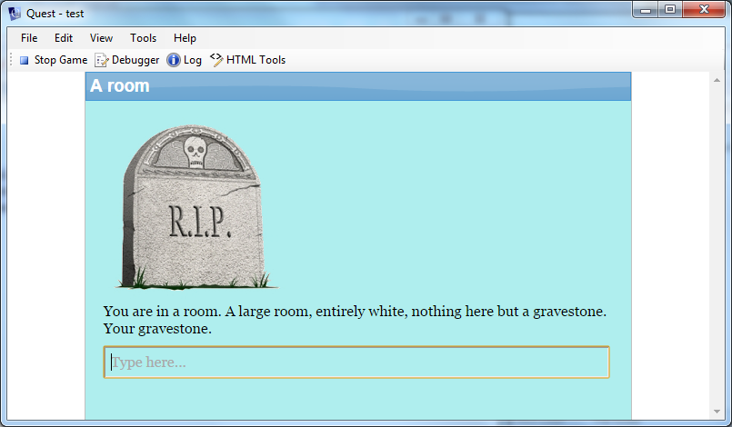
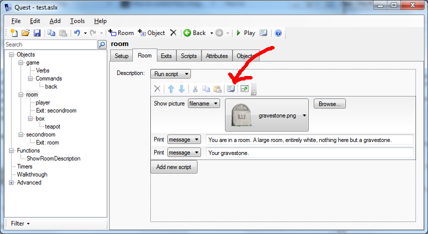
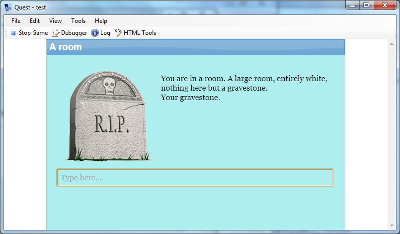
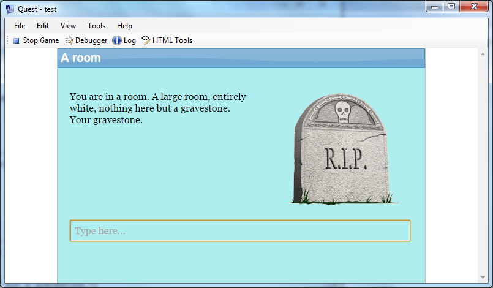
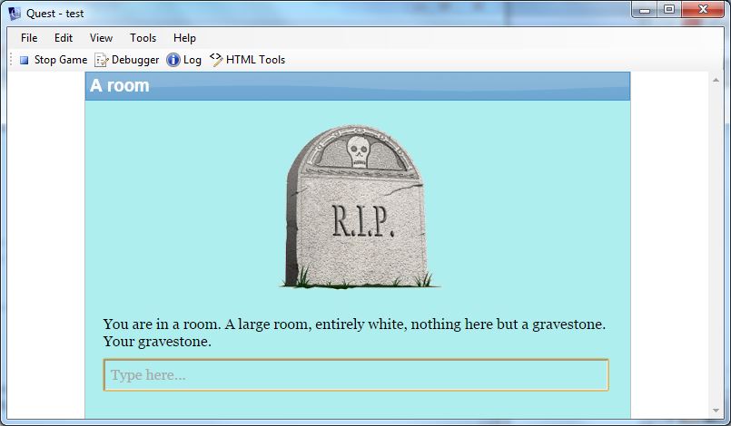
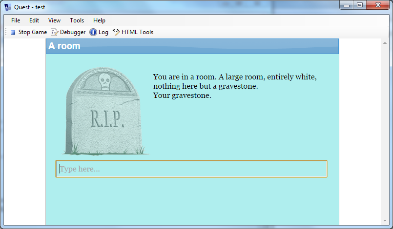
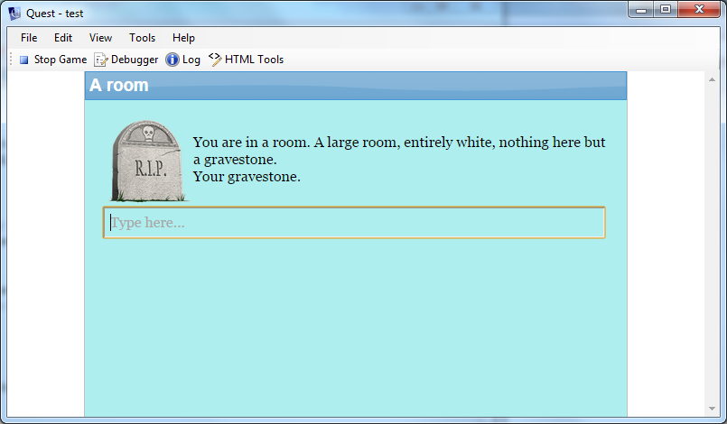
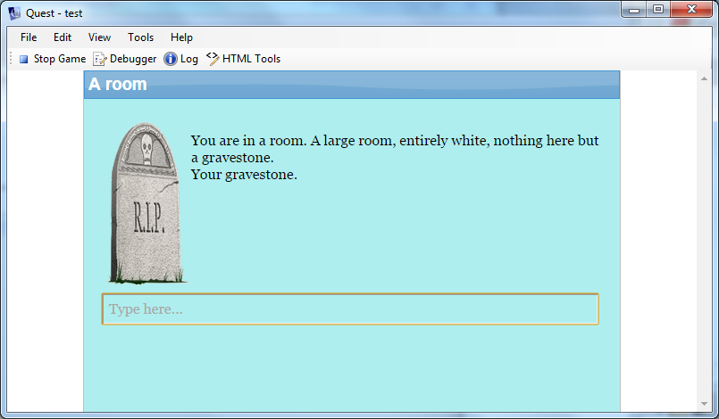
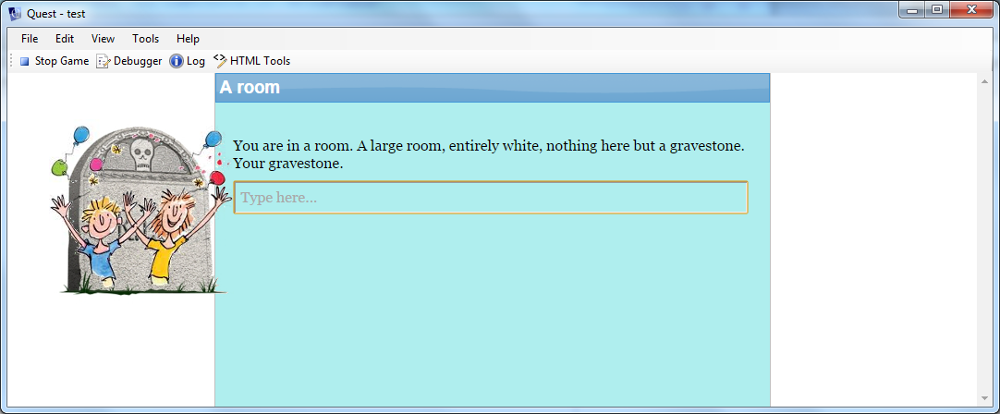
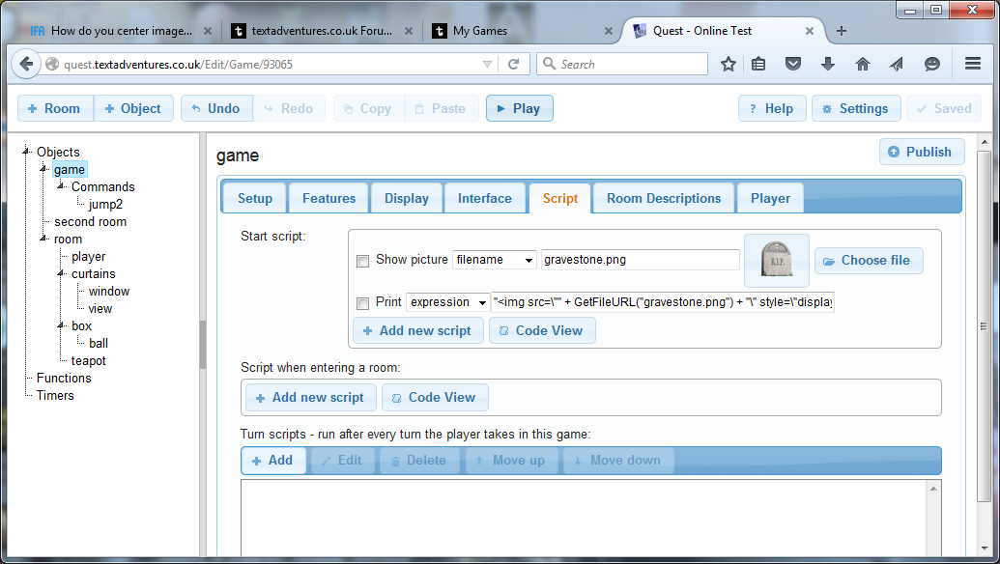

*If you are working online, it is a bit more complicated. See the section at the end.*

Quest has a built in *picture* command, which will show an image aligned to the left. Sometimes you want to change how it is displayed, for example put it in the middle, or have text flow round it. Here is an example of how it looks using the picture command. By the way, the image is in PNG format, which supports transparency, so is not surrounded by an ugly white box (you could make the background of your image the same colour as your game background, but making it transparent allows you to adjust the game background without changing all your images). [GIMP](http://www.gimp.org/) is good for editing images, and is free.

This is the script:

And this is the code behind it, which you will see by clicking on the *Code view* icon above a script (the one with the arrow!).

    picture ("gravestone.png")
    msg ("You are in a room. A large room, entirely white, nothing here but a gravestone.")
    msg ("Your gravestone.")

The picture command gives no control over the image, so we need to output the raw HTML. Sounds scary? You bet!

The HTML code will look kind of like this; "img" is the tag for image, and "src" is an attribute that indicates the source of the image:

    

If only it was that simple. That will work offline, but online, you need a full URL for the file to be found. Fortunately Quest has a function built-in to do that for you, and it will work whether your game in online or offline. This means you need to add together three strings:

    ""

The \" is an escape code that tells Quest you want the double quote character inside your string (otherwise it would think the string ended there and get confused). The code ends up looking like this.

    msg ("")
    msg ("You are in a room. A large room, entirely white, nothing here but a gravestone.")
    msg ("Your gravestone.")

the end result looks just the same so far, but this gives us a handle on changing how it looks, via the style attribute and CSS.

Changing How The Image Is Displayed
----------------------------------

Let us make the image float! When the image floats, the text will flow around it. The HTML will look kind of like this:

The "style" attribute tells Quest what style you want this thing to be. You need to be pretty specific in the values. The general format is the name of the CSS attribute ("float" in this case), followed by a colon, then the value ("left"), followed by a semi-colon. Just to help the confusion, we have CSS attributes inside of HTML attributes!

    msg ("")
    msg ("You are in a room. A large room, entirely white, nothing here but a gravestone.")
    msg ("Your gravestone.")

You can just as easily have the image on the right. Let us add another CSS attribute. The "padding" attribute controls the spacing around the image. You need to specify "px" (pixels) as the units in this case.

    msg ("")
    msg ("You are in a room. A large room, entirely white, nothing here but a gravestone.")
    msg ("Your gravestone.")

The CSS to centre an image is rather more complicated than you would imagine:

    msg ("")
    msg ("You are in a room. A large room, entirely white, nothing here but a gravestone.")
    msg ("Your gravestone.")

More Options
------------

There are all sorts of attributes you can mess around with. Here the image is transparent.

    msg ("")
    msg ("You are in a room. A large room, entirely white, nothing here but a gravestone.")
    msg ("Your gravestone.")

You can resize it. Changing just the width or height changes the image proprotionally, or you can set both.

    msg ("")
    msg ("You are in a room. A large room, entirely white, nothing here but a gravestone.")
    msg ("Your gravestone.")

    msg ("")
    msg ("You are in a room. A large room, entirely white, nothing here but a gravestone.")
    msg ("Your gravestone.")

You can even superimpose one image over another if you feel brave enough. You need to put them both inside an HTML div (this is then the reference point that the images are positioned against), and give the images an absolute postion. All that needs to go inside a single "msg" as Quest will add its own HTML.

    s = "
"
    s = s + ""
    s = s + ""
    s = s + "
"
    msg (s)
    msg ("You are in a room. A large room, entirely white, nothing here but a gravestone.")
    msg ("Your gravestone.")

As you can see, I have kind of cheated here. Using this sort of positioning puts the images outside the normal flow of elements on the page, and getting the text to go around the images would be very difficult. I have dodged that by putting the images outside the text altogether.

If you are editing online...
---------------------------

If you are online, you have two problems. It seems the code editor objects to HTML codes, and you also need to get your image uploaded, so it will be a bit more effort.

First use the picture command to upload your image. Run the game, check it is there.

Then add a message command, set it to show an expression, and paste in this:

    ""

It should look like this:

Check it works, you should see the image twice, then you can delete the picture command, and just leave your centred image.