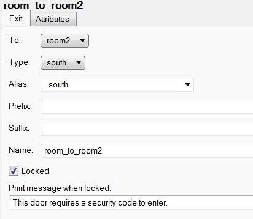
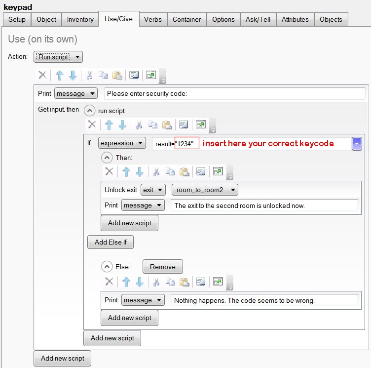

Here is an example of an exit, which will be unlocked when the player inserts the right code:

After creating an exit set the "Locked"-checkbox and the "Print message when locked". To unlock the exit later by script you must enter a name for your exit!

Then add a keypad object to your room. Go to the Use/Give tab and add a script when using the keypad on its own. This script is executed if the player types "use keypad". The player is asked to input the key and then the input is checked with an if-clause. If it is correct, the locked exit is unlocked.

Random Code
-----------

So now some wise guy has pasted the code on the internet, and everyone knows how to open the door already, without having to play part of your game. What we need is a code randomly generated each time the game is played.

So, firstly we need that random code. Click on the game object, then on the "Script" tab. The top half is for a script to run when the game starts, which is what we want. All it has to do is assign a random number to game.code (i.e., the code attribute of the game object). GetRandomInt is a function that creates random numbers, so here is the code:

        <start type="script">
          game.code = GetRandomInt (1000, 9999)
        </start>

If you prefer to use the GUI, it will look like this:

This gives a random number between 1000 and 9999. Use those numbers to ensure we get a four digit code.

The second part is to modify the exit to use the random code. In code mode, it will look like this now:

          <use type="script">
            msg ("Please enter security code:")
            get input {
              if (result=game.code) {
                UnlockExit (room_to_room2)
                msg ("The exit to the second room is unlocked now.")
              }
              else {
                msg ("Nothing happens. The code seems to be wrong.")
              }
            }
          </use>

The only difference is in the fourth line, where code is compared to game.code instead of "1234". If you prefer to use the GUI, it will look like this:

The only difference here is that code="1234" is now code=game.code.

One last thing - you need a way to tell the player what the code is. Something somewhere has to do something like this:

msg ("The code is " + game.code + ".")

In the GUI, it might look like this:

Note that it is going to print an expression, and in that expression the plain text is in double quotes, the code is game.code, as before, and it is all joined together with + signs.
