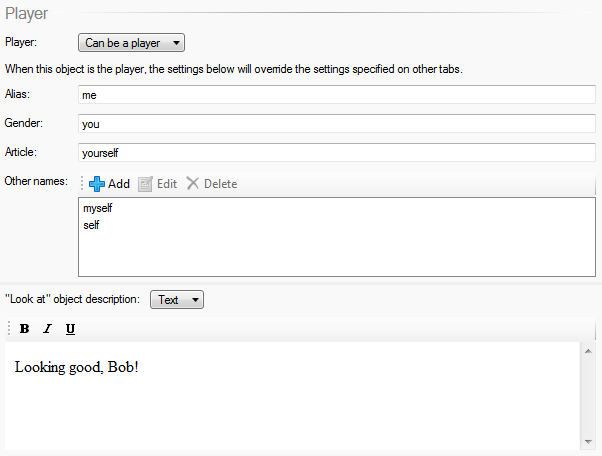

When you create a Quest game, there is by default one "player" object, which represents the player's point of view (POV). The player's inventory consists of all the objects that are contained by this "player" object.

As of Quest 5.3, you can now switch the POV at any time - your game remains a single-player experience, but that player can now switch between different characters. This means you could create a game where the player can explore from different points of view, or perhaps simply choose a pre-defined character when starting the game.

Any script can change the current POV by calling the "Change player object" command. So you could change the POV after asking a question in the game start script, in response to a command, or maybe after successfully solving a puzzle.

Each player object gets its own inventory and attributes. This includes status attributes, so each player could have their own health or stats, and these will be updated on-screen as the player switches between characters. For status attributes which apply across the entire game (perhaps "score" for example), you should set these on the "game" object itself, so they will apply all the time regardless of which object is the current POV.

Objects can behave differently depending on whether they are the player or not. For example, if you have two player objects "Dave" and "Bob" in a game, and it is possible for them to be together in the same room at the same time, you will want different responses for "look at Dave" and "look at Bob" depending on whether the player is currently Dave or Bob.

To handle this, go to the object's Options tab and look at the "Player" section. If "Can be a player" is selected, options appear where you can set an override "look at" description to display when this object is the player.

[Next: Using timers and turn scripts](using_timers_and_turn_scripts.html)