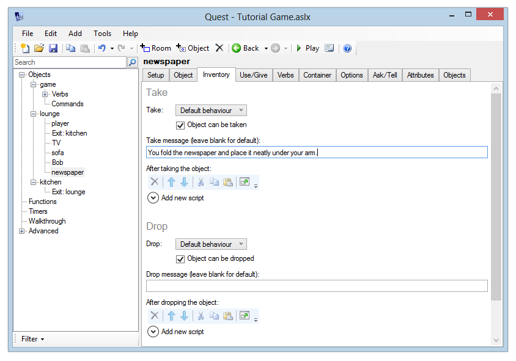
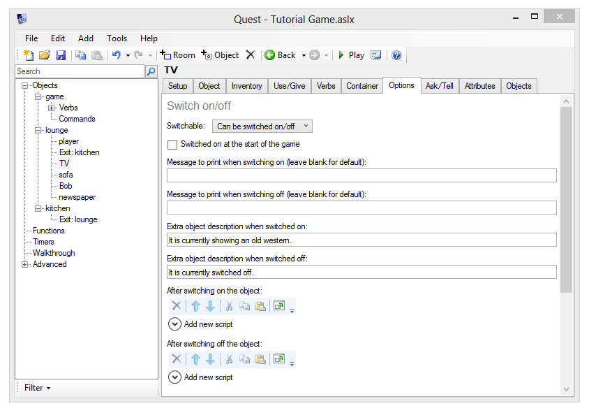
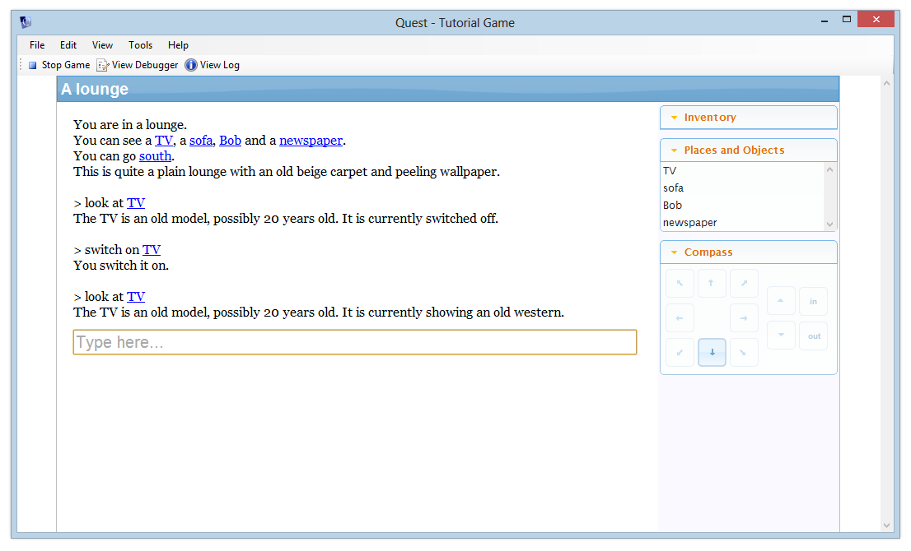

Object Types
------------

An object's "Setup" tab lets you choose the type of object. Select the "TV" object we created in the last section.

The first "Type" dropdown at the top of the screen lets you select from:

-   Room
-   Object
-   Object and/or room

Rooms and objects are really the same thing in Quest - the option you select here simply lets the editor show you only what's relevant for the current object. If you wanted to create a cupboard inside a room that the player could get in, you might want to select "object and/or room" here - but in this tutorial, just leave this option set to the default.

The second "Type" dropdown lets you select from the following types:

-   Inanimate object
-   Male character
-   Female character
-   Inanimate objects (plural)
-   Male characters (plural)
-   Female characters (plural)

Whichever type you select, the object will behave in pretty much the same way, except that Quest's default responses will make a lot more sense if you set this correctly. This is because setting the type will update the Gender and Article (you can also override these manually).

-   **Gender**: Usually "it", "he", "she" or "they". Quest uses this for sentences such as "*It* is closed", "*He* says nothing" and so on.
-   **Article**: Usually "it", "him", "her" or "them". Quest uses this for sentences such as "You pick *it* up", "You can't move *her*" and so on.

Scenery
-------

The "Scenery" option means that the object won't be displayed automatically in the room description, or the "Places and Objects" on the right of the screen.

Why might we want to do this? Well, when we created our "lounge" description in the previous section, we wrote "This is quite a plain lounge with an old beige carpet and peeling wallpaper". What if the player types "look at wallpaper"? Quest will reply "I can't see that here", which will be a bit strange.

Although the wallpaper isn't an important object, we should still have a response for "look at wallpaper". If we make it a scenery object, it's "in the background" as far as the game goes, as it won't appear in the "Places and Objects" list, or in the list of objects in the description of the room. We won't be cluttering things unnecessarily, but we will still be providing responses for anything the player might reasonably type in.

So, create a new object called "wallpaper" and tick the Scenery box. Enter a description like "The horrible beige wallpaper hangs loosely on the walls."

Launch the game and verify that although the wallpaper doesn't explicitly appear in the description, you can still get a sensible response by typing "look at wallpaper".

Exercise
--------

Remember that we also mentioned the carpet in the room description as well. As an exercise, add this as another scenery object, and give it a sensible description.

Creating a Character
--------------------

Let's create our first character. He'll be about as basic a character as you can get, and he won't be the most talkative. This is because he's dead. Well, you've got to start somewhere.

Create a new object called "Bob" and change his type to "Male character". Give him a "look" description of "Bob is lying on the floor, a lot more still than usual."

There is one other thing we need to do. If you run the game now, you'll see the room description says "You can see a TV, a sofa and *a* Bob". There's only one Bob - well, in this game anyway - so we want to get rid of that "a". Where did that even come from? The answer is the prefix.

Prefix and Suffix
-----------------

A prefix and a suffix let you insert text before and after the object name when it's displayed in a room description. When you leave "Use default prefix and suffix" checked, the suffix is blank, and the prefix (for English games) is either "a" or "an" depending on whether the object name (or alias) begins with a vowel.

You can specify your own text by unchecking the box. Two new textboxes will appear, and for our "Bob" character you can just leave them blank, as we don't want any text added around our object name.

A quicker way of doing this is to select "Male character (named)" from the types list.

We will come back to Bob later in the tutorial, where will make him a little more animated.

Taking the newspaper
--------------------

You should have added a newspaper object as an exercise at the end of the previous section. If you didn't, add one now. We're going to make this an object that the player can take.

This is very easy to do - simply go to the "Inventory" tab. You have a couple of different options for "Take":

Default behaviour: You'll want to use this for most of your take-able objects. This option gives you the "Object can be taken" checkbox, and the ability to specify a "take message" which is printed when the player takes (or attempts to take) the object.
Run script: If you want full control over what happens when the player attempts to take the object, choose this option. We will cover scripts later on in the tutorial, so don't choose this for now.  

To let the player take the newspaper, we just need to tick the "Object can be taken" box. If you don't specify a message, you'll get a default message - "You pick it up". If you want something a bit more imaginative, you can enter a Take Message such as "You fold the newspaper and place it neatly under your arm".

The "Object can be dropped" box is ticked by default, so the player can take and drop the object as many times as they like. The options are the same as for "Take", so you can specify your own drop message or completely customise the behaviour with a script if you like.

Switching the TV on and off
---------------------------

Let's make it possible to turn the TV off. To do this, select the TV and go to the Options tab. You'll see a dropdown labelled "Switchable" - select "Can be switched on/off" and various options will appear.

The options should be fairly self-explanatory - you can choose whether the object is switched on when the game begins, and the text to print when switching on/off. Finally, you can choose some extra text to add to the object description. This lets you have show text depending on whether the object is switched on or off.

Enter some sensible text for these, for example as shown below.

Go back to the Setup tab and change the "Look at" description so it just reads "The TV is an old model, possibly 20 years old."

Now when you play the game, you get sensible behaviour for "switch on tv", "switch off tv", and alternative forms of the command.

Notice that by setting this object up as "Can be switched on/off", two new options "switch on" and "switch off" have automatically appeared in the TV hyperlink menu.

Exercise
--------

Add a "switchable" lamp to the lounge that is switched on at the start of the game.

[Next: Anatomy of a Quest game](anatomy_of_a_quest_game.html)