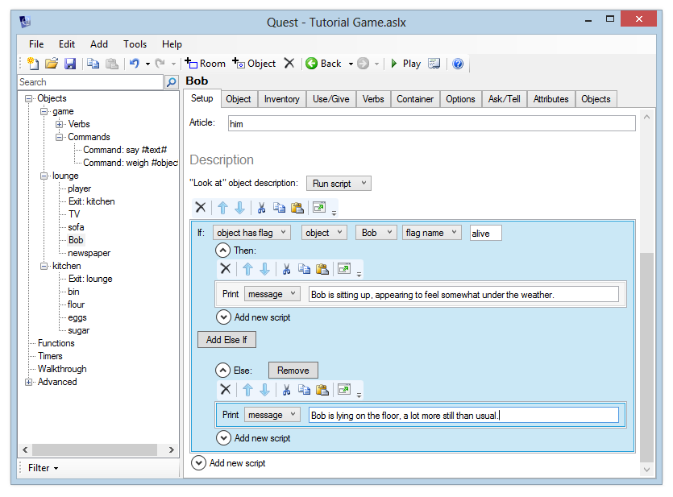
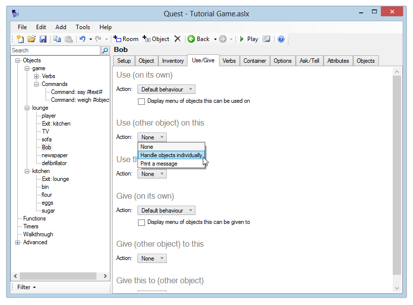
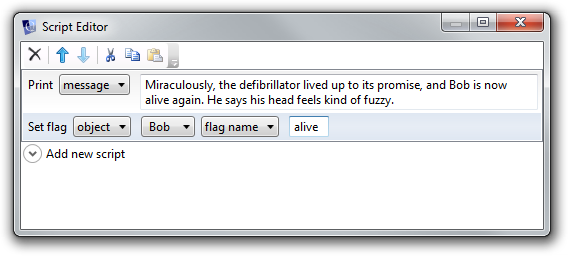
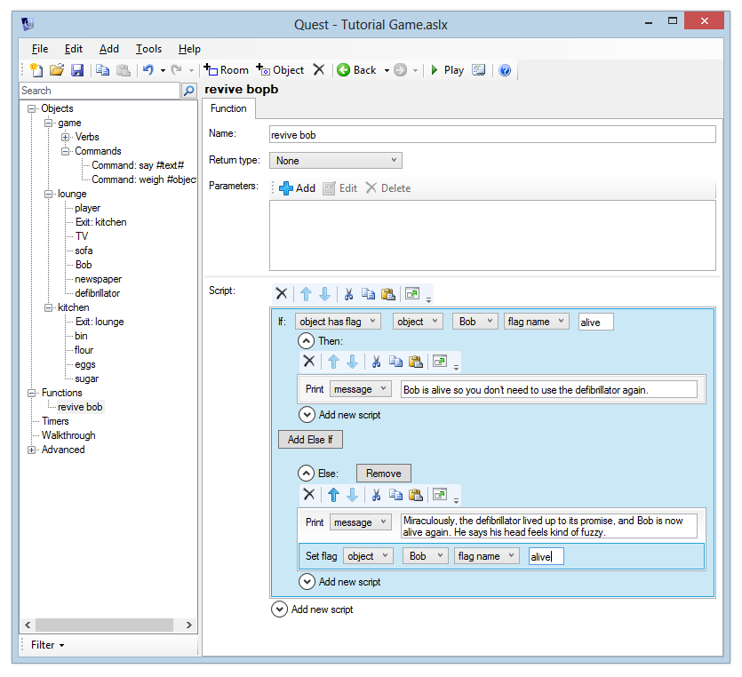
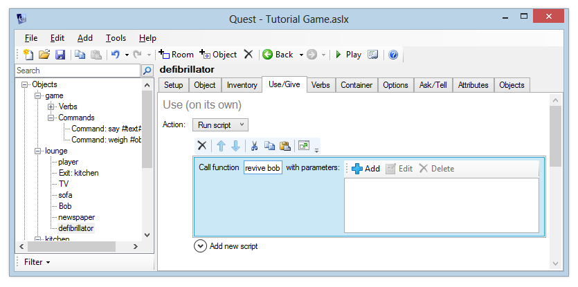
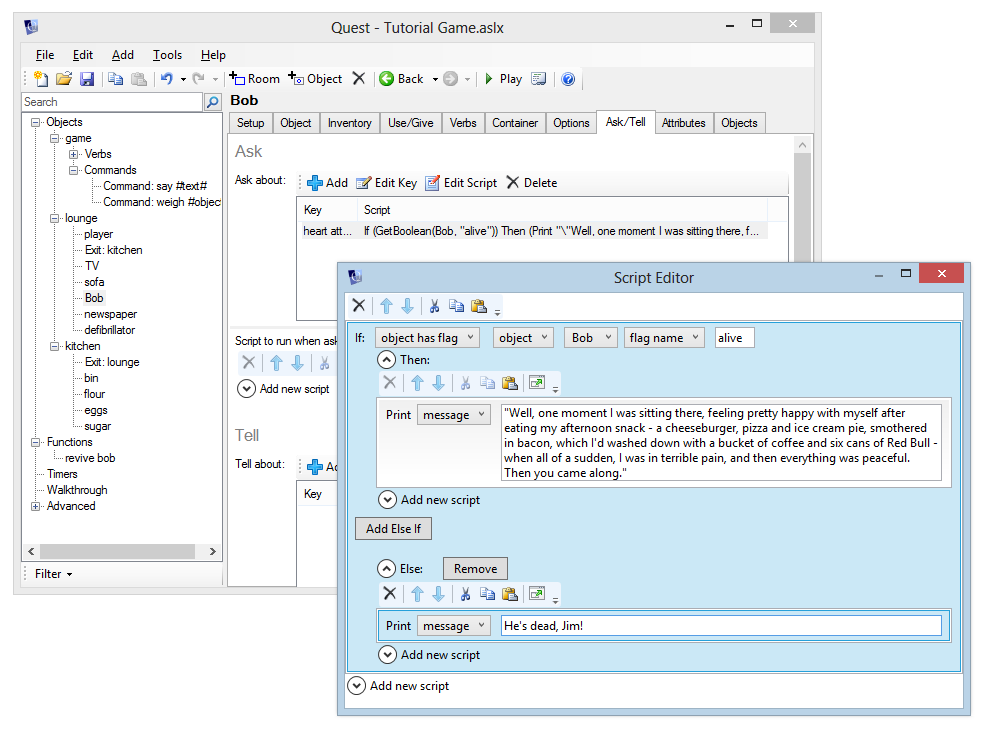

Giving and Using objects
------------------------

After a player has taken an object, they can give that object to, or use it on, other objects in the game.

For example, after picking up some flowers, a player can give them to a character called "Susan" by typing "give flowers to susan".

"Give" and "Use" are set up in exactly the same way – the only difference is whether the player types "give ... to ..." or "use ... on ...".

In this example, we are going to revive the corpse of Bob in the lounge, using a [heart defibrillator](http://en.wikipedia.org/wiki/Defibrillation). First, we need to alter the setup of Bob so that we give a correct description whether he is dead or alive. To do this, we are going to use an **object flag**.

An object flag is simply a way of accessing a boolean attribute of an object (a boolean attribute is simply one that can only be either "true" or "false"). You can use it to mark certain things as "done" - in this case, using the defibrillator on Bob is going to add a flag called "alive" to Bob. So in the "look at" description, we'll check whether Bob has his "alive" flag set. If so, we'll print "Bob is sitting up, appearing to feel somewhat under the weather", and if not, we'll print the old description "Bob is lying on the floor, a lot more still than usual."

Updating the description
------------------------

Getting the correct description to display is very similar to the "watch" example in the [Using scripts](using_scripts.html) section.

Change Bob's "look at" description to "Run script", and add an "if" command.

For the expression, choose "object has flag". Then select "Bob" and enter the flag name "alive". Add the descriptions above for "then" and "else" messages.

Using the defibrillator
-----------------------

Now, add a "defibrillator" object to the lounge. Enter a description like "A heart defibrillator can magically revive a dead person, if all those hospital dramas are to be believed."

Go to the Inventory tab and tick "Object can be taken".

Now go back to Bob. On *his* Use/Give tab, go to the "Use (other object) on this" section and choose "Handle objects individually".

A list will appear in the "Use" section. Here you can add the objects that can be used on Bob, with a script for each. Click "Add" and type "defibrillator".

A Script Editor window will now pop up. In this script, we want to print a message to tell the player what's happening, and also set the "alive" flag on Bob.

So, add a "print a message" script and type something like "Miraculously, the defibrillator lived up to its promise, and Bob is now alive again. He says his head feels kind of fuzzy."

Now add a "Set object flag" command. Choose Bob from the objects list, and enter the flag name "alive".

Close the Script Editor window. Now run the game. Look at Bob, then type "use defibrillator on bob", then look at Bob again. Verify that you see the correct text in each case.

Notice what happens when you type "use defibrillator on bob" a second time - you get the same response again. You should know how to fix this now - update your "use defibrillator on bob" script to check for the "alive" flag. Update this now.

Using Functions
---------------

It would be good if we could get the same effect just by typing "use defibrillator". There are a couple of things we could do here, from the defibrillator Use/Give tab, under "Use (on its own)":

-   we can tick "Display menu of objects this can be used on". This will allow the player to select Bob to use the defibrillator on.
-   we can choose "Run script" from the Action list, to automatically defibrillate Bob.

The first option is definitely the easiest, but the second option allows us to demonstrate the use of functions.

Of course, we could simply copy the script we created in the section above, and paste it into the defibrillator's "use this object (on its own)" script. However, if we then wanted to make an update to one script, we would have to update the other one as well.

The best way to resolve this is to make both our existing "use defibrillator on Bob", and our new "use defibrillator" point to the same script. The way to do this is to set up a **function**.

Functions provide a way for you to set up scripts that can be called from anywhere in your game, so you don't have to keep copying and pasting or re-entering the script.

Let's create one now to store the script commands we use to resuscitate Bob. We can then set both "use defibrillator on bob" and "use defibrillator" to call this function.

First, go to Bob's Use/Give tab, and double click "defibrillator" in the "Use" table to bring up the Script Editor. Hold down the shift key and select all script lines, then click the Cut button to move this script to the clipboard. Now close the window.

Now add a new function (right click the tree, or use the Add menu), and call it "revive bob". For the script, click the Paste button.

Now we just need to update "use defibrillator on bob" and create "use defibrillator", to make them call this function. Go back to Bob's use/give tab, and double-click to edit the defibrillator script again.

Add a "call function" script, and enter the name "revive bob". Now close the window.

Now we're kind of back where we started - if you run the game and type "use defibrillator on bob", it calls the "revive bob" function and so we get exactly the same behaviour as before.

We just need to make "use defibrillator" call the same function now, so go to the defibrillator's use/give tab, and in the "use (on its own)" section choose "Run a script". Add a "call function" script, so that it also calls the "revive bob" function.

Launch the game now and verify you get the same response whether you type "use defibrillator on bob" or just "use defibrillator".

Note that if you pick up the defibrillator and go to the kitchen, "use defibrillator" will still work. It would be pretty remarkable for a defibrillator to work at such a long range, so consider adding an "if" command to the "revive bob" procedure. You can select "player is in room" from the list of conditions to check whether the player is in the lounge before carrying out the defibrillation. If they're not in the lounge, print a suitably sarcastic message.

Giving objects
--------------

Giving an object to a character works in exactly the same way as using objects on a character. Look at the "Give" sections - notice that you get the same options as for "Use". You can add objects to it in the same way.

Ask and Tell
------------

Ask and Tell work in the same way, so we'll only cover "ask" here.

Click on Bob and go to the "Ask/tell" tab. (If you can't find this tab, you will have to activate this feature in the Features tab in the "game" section.) Here you can add subjects to the list, and give a script for each subject. You can also give a script to run when the player asks Bob about something he doesn't know about.

Let's make Bob respond to a question about the massive heart attack he's just amazingly recovered from. Click the "Add"  button and enter some topic keywords, for example "heart attack cardiac arrest". When the player asks Bob about anything, this list of keywords is checked for matches in the player's command. So the player could type "ask bob about heart" or "ask bob about cardiac arrest", and that will match this topic.

A Script Editor will appear. It would make sense that the player can only ask questions of Bob when he's been brought back to life, so the first thing to do is add an "if" command and check that Bob's "alive" flag is set. If it is, he can say something like "Well, one moment I was sitting there, feeling pretty happy with myself after eating my afternoon snack - a cheeseburger, pizza and ice cream pie, smothered in bacon, which I'd washed down with a bucket of coffee and six cans of Red Bull - when all of a sudden, I was in terrible pain, and then everything was peaceful. Then you came along."

[Next: Using containers](using_containers.html)