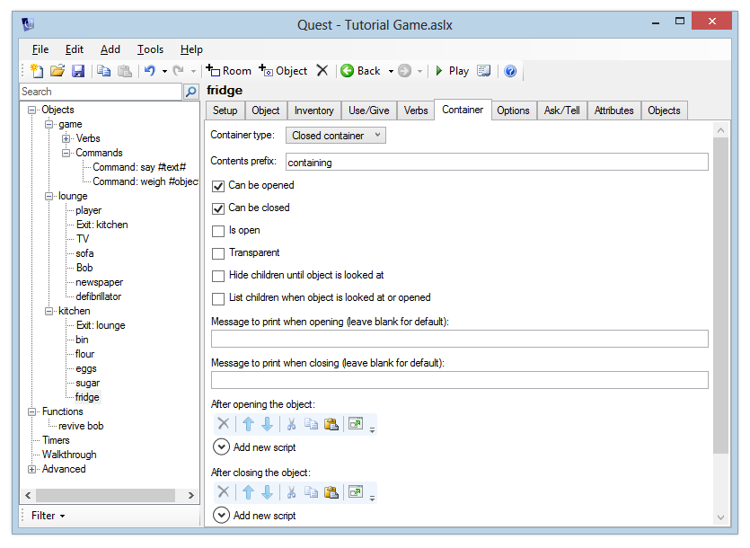
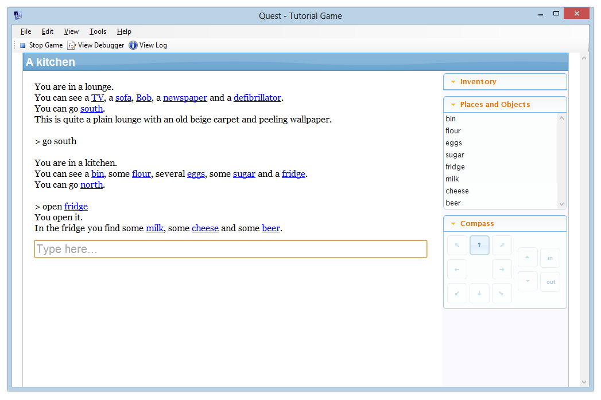

Containers are objects which can contain other objects. In this example, we'll create a "fridge" object in the kitchen, which contains several items of food and drink. The fridge is initially closed, so these items will only be visible once the player has opened the fridge.

Creating the Fridge
-------------------

Create a "fridge" object in the kitchen and give it a description like "A big old refrigerator sits in the corner, humming quietly."

Now let's set the fridge up as a container. Click the Container tab. By default, "Not a container" is selected. Change this to "Closed container". The Container options will now appear.

By default, the player can open and close the fridge. We're going to add some objects to the fridge in a moment, and it would be good if the contents were listed when the player opened the fridge, so tick the "List children when object is looked at or opened" option.

Adding objects to the fridge
----------------------------

Now let's create some objects inside the fridge. To do this, we just create these objects as normal, but on the "Add object" window we set the parent to "fridge".

Add the following objects: milk, cheese, beer. Give each object a sensible description. The prefix for each object should be "some", so that the room description sounds natural. Allow each object to be taken.

Now run the game and go to the kitchen. Notice that you can't see the milk, and if you type something like "look at milk", Quest will tell you that it's not here. Now open the fridge, and the objects inside it will be revealed.

By setting the "List prefix" you can change the "It contains" text which appears before the list of objects.

Updating the description
------------------------

In your "look at" description, you can check if the object is open by running a script. Add an "if" command and choose "object is open" - then you can print a different message depending on whether the fridge is open or closed.

When the fridge is open, you might print "The fridge is open, casting its light out into the gloomy kitchen". When it is closed, you might print "A big old refrigerator sits in the corner, humming quietly".

As an exercise, add a closed cupboard to the kitchen. Add a few items to the cupboard such as a tin of beans, a packet of rice etc. The player should be able to open and close the cupboard. When Quest lists the contents of the cupboard, it should say something like "The cupboard is bare except for ..."

Transparency
------------

When you set the "Transparent" option, the player can see what objects are inside the container, even if it is closed.

Although the player can see what's inside a transparent container, they still can't take objects from it or put objects in it unless it is open.

Surfaces
--------

Surfaces act very much like containers - they act as an always-open container, and objects that are on a surface are visible in a room description even before the player has looked at the surface. For this reason they’re a good choice for implementing things like tables. As an exercise, change the table object in the lounge to make it a surface (or create it if you haven't already). Then move the newspaper so that it is on the table - in the Windows version, you can drag the newspaper object in the tree, and drop it on to the table to move it there. In the web version, select the newspaper object and click the Move button in the top right of the screen.

[Next: Moving objects during the game](moving_objects_during_the_game.html)