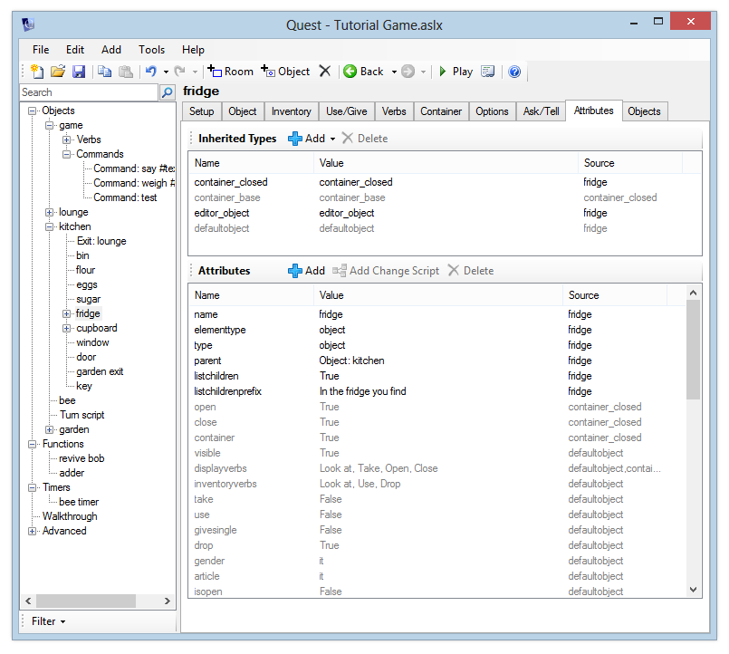

Note: Inherited types can currently only be edited in the Windows desktop version of Quest.

Earlier in the tutorial we covered [Custom attributes](custom_attributes.html). Now we're going to cover **types**, which let you set up common sets of attributes which can be inherited by other objects.

Built-in types
--------------

Quest makes extensive use of types internally. There is a [container](../attributes/container.html) type which gives all container objects standard functionality, such as being able to be opened, and so on. There is a [switchable](../attributes/switchable.html) type which allows objects to be switched on and off.

You can see which types an object inherits by going to the Attributes tab and looking under Inherited Types. You can find the type definitions themselves by going Object Types in the tree (under the Advanced section) - click Filter and turn on "Show Library Elements" to show the types that Core.aslx defines.

Note that types themselves can inherit other types.

When you're looking at an Attributes tab, you can see the Source for an attribute in the right-hand column. For example, click the "table" object in the tutorial game. You can see that it inherits a "transparent" attribute from the [surface](../attributes/surface.html) type. You can also see from the Inherited Types list that the "surface" type itself inherits [container\_base](../attributes/container_base.html), which is the source of the "container" attribute.

Attributes which have a source of the object itself are shown in black; all attributes inherited from types (and types inherited from types) are shown in grey.

The default types
-----------------

All objects inherit from the [defaultobject](../attributes/defaultobject.html) type - there is no way to remove this. Similarly, all exits inherit from defaultexit etc. You can edit these types by selecting them in the tree and then clicking the Copy button to move the definition into your game. Be careful though, as any changes you make here will affect all objects, and so could potentially have far-reaching effects!

Creating your own types
-----------------------

You can create your own types via the Add menu. You can then add attributes and inherited types to it, in just the same way as you would for an object. You can then use this type in an object by going to the object's Attributes tab, and adding the type from the drop-down list.

For more on creating your own types, see the [Using Types](../guides/using_types.html) page.

[Next: Using libraries](using_libraries.html)